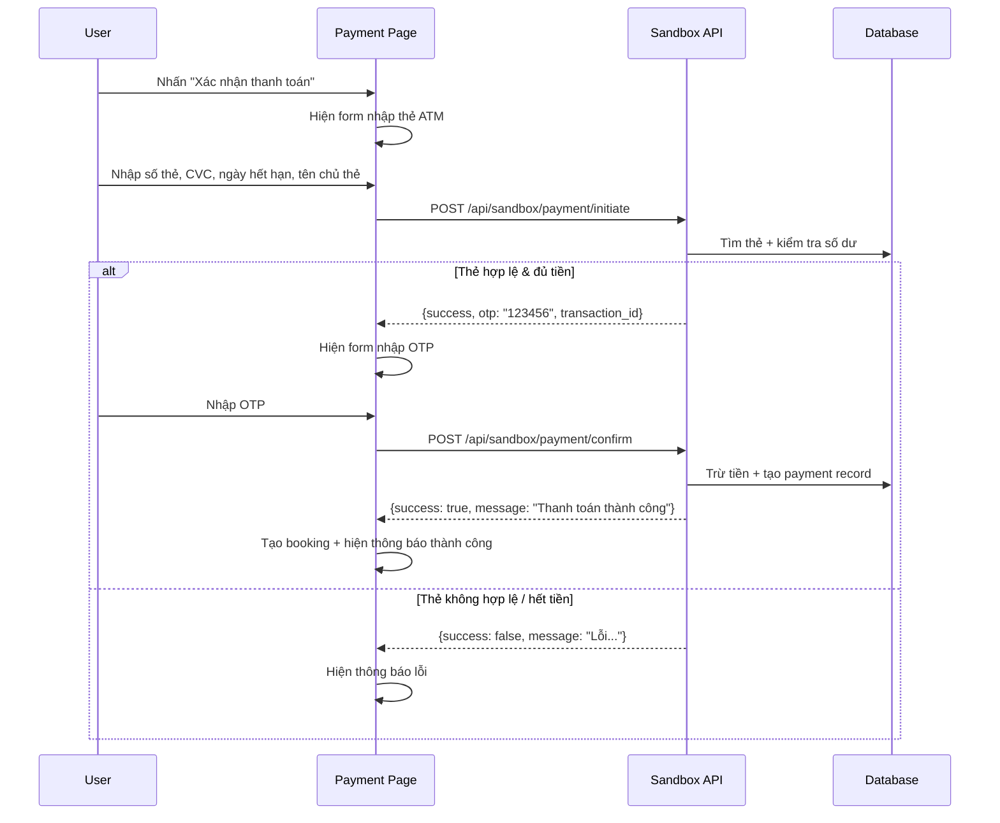

# Payment Sandbox - Giả lập cổng thanh toán ATM

Tạo một hệ thống sandbox giả lập thanh toán thẻ ATM ngay trong project. User nhập số thẻ, CVC, hết hạn → hệ thống kiểm tra thẻ có tồn tại không, số dư đủ không → gửi OTP giả → xác nhận → trừ tiền → trả về kết quả.

## Luồng hoạt động



## Proposed Changes

### Database - Bảng thẻ giả lập

#### [NEW] [create-sandbox-cards.js](file:///c:/BDU/Năm%202/Kì%202/Lập%20trình%20web/web-du-lich/server/create-sandbox-cards.js)

Script tạo bảng `sandbox_cards` và seed dữ liệu thẻ mẫu:

```sql
CREATE TABLE sandbox_cards (
  id INT AUTO_INCREMENT PRIMARY KEY,
  card_number VARCHAR(19) NOT NULL UNIQUE,  -- "9704 0000 0000 0018"
  card_holder VARCHAR(255) NOT NULL,         -- "NGUYEN VAN A"
  expiry_date VARCHAR(5) NOT NULL,           -- "12/28"
  cvv VARCHAR(4) NOT NULL,                   -- "123"
  balance DECIMAL(15,0) NOT NULL DEFAULT 10000000,  -- 10,000,000₫
  bank_name VARCHAR(100) DEFAULT 'Vietcombank',
  is_active BOOLEAN DEFAULT TRUE,
  created_at TIMESTAMP DEFAULT CURRENT_TIMESTAMP
);
```

**Dữ liệu thẻ mẫu:**

| Số thẻ | Chủ thẻ | Hết hạn | CVV | Số dư | Ngân hàng |
|--------|---------|---------|-----|-------|-----------|
| 9704 0000 0000 0018 | NGUYEN VAN A | 12/28 | 123 | 10,000,000₫ | Vietcombank |
| 9704 0000 0000 0026 | TRAN THI B | 06/27 | 456 | 500,000₫ | Techcombank |
| 9704 0000 0000 0034 | LE VAN C | 03/29 | 789 | 50,000,000₫ | BIDV |
| 9704 0000 0000 0042 | PHAM THI D | 01/26 | 321 | 0₫ | Agribank |

→ Thẻ `0042` dùng để test trường hợp **không đủ tiền**.

---

### Server API Routes

#### [NEW] [route.js](file:///c:/BDU/Năm%202/Kì%202/Lập%20trình%20web/web-du-lich/server/src/app/api/sandbox/payment/route.js)

Hai endpoint:

1. **POST `/api/sandbox/payment/initiate`** — Kiểm tra thẻ
   - Input: `card_number`, `card_holder`, `expiry_date`, `cvv`, `amount`
   - Validate thẻ tồn tại, thông tin khớp, thẻ active, chưa hết hạn, đủ tiền
   - Trả về `transaction_id` + mã OTP cố định `"123456"` (hiển thị trên UI cho sandbox)

2. **POST `/api/sandbox/payment/confirm`** — Xác nhận OTP, trừ tiền
   - Input: `transaction_id`, `otp`
   - Verify OTP = `"123456"`
   - Trừ tiền từ `sandbox_cards.balance`
   - Trả về kết quả thanh toán

---

### Client - Giao diện thanh toán

#### [MODIFY] [Payment.jsx](file:///c:/BDU/Năm%202/Kì%202/Lập%20trình%20web/web-du-lich/client/src/pages/Payment.jsx)

Khi user chọn phương thức "Thẻ tín dụng/ghi nợ" và nhấn "Xác nhận thanh toán":
1. Hiện **modal step 1** — form nhập thẻ (số thẻ, tên, ngày hết hạn, CVV)
2. Gọi API initiate → nếu OK → chuyển sang **modal step 2** — nhập OTP
3. Hiển thị OTP sandbox trên UI (vì đây là sandbox, OTP sẽ luôn là `123456`)
4. User nhập OTP → gọi API confirm → nếu OK → tạo booking → hiện modal thành công

Nếu chọn "Ví MoMo" thì giữ nguyên flow cũ (tạo booking trực tiếp).

#### Thiết kế UI modal:
- **Step 1 (Card Input):** Form nhập 4 trường + nút "Thanh toán" + hiện thông tin "Thẻ test" ở dưới
- **Step 2 (OTP):** 6 ô input OTP + countdown 60s + nút "Xác nhận" + hint "Mã OTP sandbox: 123456"
- Animations mượt mà, premium UI

---

### Schema update

#### [MODIFY] [schema.sql](file:///c:/BDU/Năm%202/Kì%202/Lập%20trình%20web/web-du-lich/server/schema.sql)

Thêm `CREATE TABLE sandbox_cards` vào cuối file schema.

## Verification Plan

### Manual Verification

Sau khi triển khai xong, test theo các bước sau:

1. **Chạy script tạo bảng:** `node server/create-sandbox-cards.js` → bảng và dữ liệu mẫu được tạo
2. **Truy cập trang thanh toán** một property bất kỳ
3. **Test case 1 - Thanh toán thành công:**
   - Chọn "Thẻ tín dụng/ghi nợ" → nhấn "Xác nhận thanh toán"
   - Nhập thẻ: `9704 0000 0000 0018`, tên `NGUYEN VAN A`, hết hạn `12/28`, CVV `123`
   - Nhập OTP `123456` → thanh toán thành công, booking được tạo
4. **Test case 2 - Không đủ tiền:**
   - Dùng thẻ `9704 0000 0000 0042` (số dư 0₫) → hiện lỗi "Số dư không đủ"
5. **Test case 3 - Sai thông tin thẻ:**
   - Nhập số thẻ bất kỳ không tồn tại → hiện lỗi "Thẻ không hợp lệ"
6. **Test case 4 - Sai OTP:**
   - Nhập đúng thẻ, nhưng OTP nhập sai → hiện lỗi "Mã OTP không chính xác"
