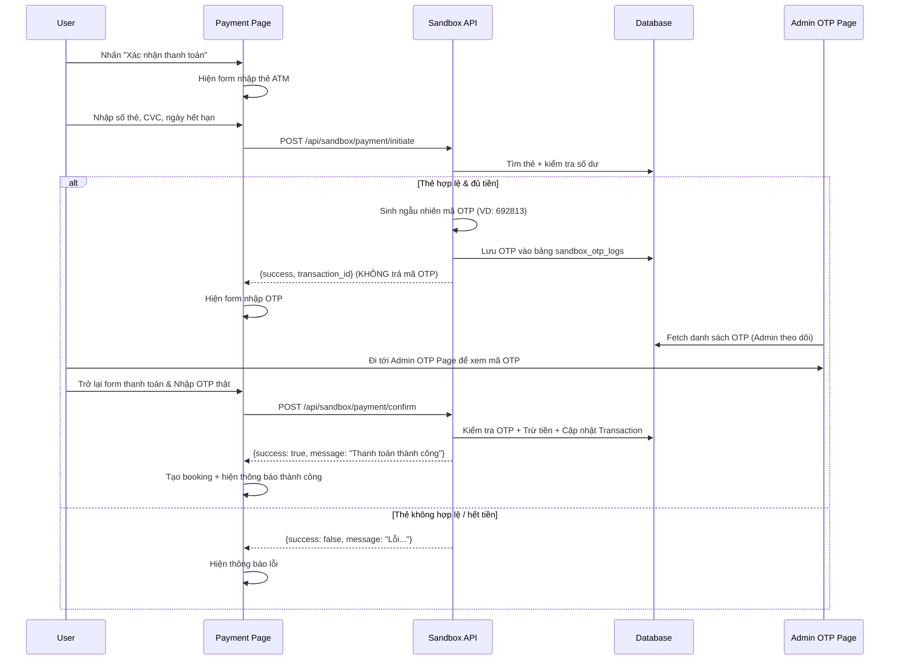

# Payment Sandbox - Giả lập cổng thanh toán ATM (Real OTP & Admin OTP Page)

Tạo một hệ thống sandbox giả lập thanh toán thẻ ATM ngay trong project. User nhập số thẻ, CVC, hết hạn -> hệ thống kiểm tra thẻ có tồn tại không, số dư đủ không -> hệ thống sinh OTP ngẫu nhiên (OTP thật) và gửi đi -> cung cấp trang Admin lưu lịch sử OTP -> user lấy OTP -> xác nhận -> trừ tiền -> trả về kết quả.

## Cập nhật theo yêu cầu mới

- **Sinh OTP động & thật:** Không dùng mã OTP cố định (`123456`) nữa. Hệ thống sẽ sinh mã ngẫu nhiên (6 số) mỗi lần giao dịch được khởi tạo. 
- **Trang Quản trị OTP:** Thêm 1 trang bên trong Admin Dashboard để quản lý lịch sử gửi OTP. Nhờ vậy, khi test thanh toán, tester có thể vào trang Admin để lấy mã OTP hoặc xác minh OTP đã được sinh ra.

## Luồng hoạt động



## Proposed Changes

### Database - Bảng thẻ giả lập và Lịch sử OTP

#### [NEW] [create-sandbox-cards.js](file:///c:/BDU/Năm%202/Kì%202/Lập%20trình%20web/web-du-lich/server/create-sandbox-cards.js)

Script tạo bảng `sandbox_cards`, bảng `sandbox_otp_logs` và seed dữ liệu thẻ mẫu.

```sql
CREATE TABLE sandbox_cards (
  id INT AUTO_INCREMENT PRIMARY KEY,
  card_number VARCHAR(19) NOT NULL UNIQUE,  -- "9704 0000 0000 0018"
  card_holder VARCHAR(255) NOT NULL,         -- "NGUYEN VAN A"
  expiry_date VARCHAR(5) NOT NULL,           -- "12/28"
  cvv VARCHAR(4) NOT NULL,                   -- "123"
  balance DECIMAL(15,0) NOT NULL DEFAULT 10000000,  -- 10,000,000₫
  bank_name VARCHAR(100) DEFAULT 'Vietcombank',
  is_active BOOLEAN DEFAULT TRUE,
  created_at TIMESTAMP DEFAULT CURRENT_TIMESTAMP
);

CREATE TABLE sandbox_otp_logs (
  id INT AUTO_INCREMENT PRIMARY KEY,
  transaction_id VARCHAR(100) NOT NULL UNIQUE,
  card_number VARCHAR(19) NOT NULL,
  otp_code VARCHAR(6) NOT NULL,
  amount DECIMAL(15,0) NOT NULL,
  status VARCHAR(20) DEFAULT 'PENDING', -- PENDING, USED, EXPIRED
  created_at TIMESTAMP DEFAULT CURRENT_TIMESTAMP
);
```

**Dữ liệu thẻ mẫu:** (Vẫn giữ nguyên như cũ để test)
| Số thẻ | Chủ thẻ | Hết hạn | CVV | Số dư |
|--------|---------|---------|-----|-------|
| 9704 0000 0000 0018 | NGUYEN VAN A | 12/28 | 123 | 10,000,000₫ |
| 9704 0000 0000 0042 | PHAM THI D | 01/26 | 321 | 0₫ | (Dùng test hết tiền)

---

### Server API Routes

#### [NEW] [route.js](file:///c:/BDU/Năm%202/Kì%202/Lập%20trình%20web/web-du-lich/server/src/app/api/sandbox/payment/route.js)

Hai endpoint chính cho thanh toán:

1. **POST `/api/sandbox/payment/initiate`**
   - Validate thẻ. Sinh mã OTP thật (random 6 số). 
   - Ghi log vào bảng `sandbox_otp_logs`. 
   - Gửi OTP qua email cho đối tượng thanh toán (tùy chọn theo tích hợp Resend).
   - Trả về `transaction_id`. Tuyệt đối **không** trả về mã OTP trong response API.

2. **POST `/api/sandbox/payment/confirm`**
   - Tìm theo `transaction_id` và `otp_code` trong bảng `sandbox_otp_logs`.
   - Cập nhật status OTP thành USED, trừ tiền thẻ.

#### [NEW] [route.js](file:///c:/BDU/Năm%202/Kì%202/Lập%20trình%20web/web-du-lich/server/src/app/api/admin/otps/route.js)

API cho Admin page:
- **GET `/api/admin/otps`**: Lấy danh sách lịch sử sinh OTP từ bảng `sandbox_otp_logs`, sắp xếp mới nhất lên đầu để admin dễ dàng lấy mã test.

---

### Client - Giao diện

#### [NEW] [AdminOtpPage.jsx](file:///c:/BDU/Năm%202/Kì%202/Lập%20trình%20web/web-du-lich/client/src/pages/admin/AdminOtpPage.jsx)

Trang Admin mới quản lý OTP:
- Router: `/admin/otps`
- Hiển thị danh sách bảng: `Id`, `Transaction ID`, `Card Number`, `OTP Code`, `Amount`, `Status`, `Created At`.
- Tự động call API `GET /api/admin/otps`.

#### [MODIFY] [Payment.jsx](file:///c:/BDU/Năm%202/Kì%202/Lập%20trình%20web/web-du-lich/client/src/pages/Payment.jsx)

- Khi khởi tạo thanh toán xong, chuyển sang bước nhập OTP.
- Lời nhắc: "Vui lòng nhập mã OTP đã được gửi đến bạn (hoặc kiểm tra ở hệ thống Quản trị)." (Không hiển thị luôn OTP cố định 123456 ở client nữa).

---

### Schema update

#### [MODIFY] [schema.sql](file:///c:/BDU/Năm%202/Kì%202/Lập%20trình%20web/web-du-lich/server/schema.sql)

Thêm query `CREATE TABLE sandbox_cards` và `CREATE TABLE sandbox_otp_logs` vào lược đồ cơ sở dữ liệu.

## Verification Plan

### Manual Verification

1. **Khởi tạo dữ liệu:** Chạy script tạo bảng `node server/create-sandbox-cards.js`.
2. **Giao diện Admin:** Vào lộ trình `/admin/otps`. Trang sẽ trống ở lần đầu.
3. **Mô phỏng Thanh toán:** Chọn "Thẻ tín dụng/ghi nợ" -> Nhập đúng thẻ 9704000000000018 -> Gửi.
4. **Kiểm tra OTP mới:** 
   - Hệ thống không hiển thị OTP ở trang thanh toán trực tiếp.
   - Quay sang tab Admin OTP Page, refresh sẽ thấy dòng record mới với trạng thái PENDING cùng chuỗi OTP được sinh động (ví dụ 821943).
5. **Xác nhận Thanh toán:** Dùng mã OTP lấy được trong Admin nhập vào ô OTP ở trang thanh toán.
6. **Thành công:** Kiểm tra status trong Admin OTP thành 'USED' và booking được trả về thành công.
7. **Sai mã OTP:** Chạy lại flow và cố ý nhập sai, hệ thống phải báo "Mã OTP không chính xác".
